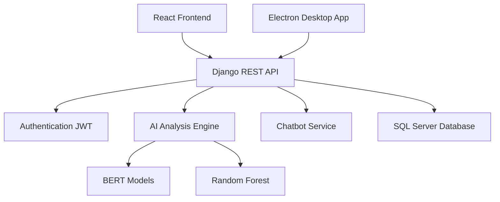

# 🚀 Recruitment AI System

### AI-Powered Internship Recruitment & Candidate Management Platform

Transforming a paper-based recruitment process into an intelligent, automated, and data-driven hiring ecosystem.

Developed for **BTPH Hasnaoui Group (Sidi Bel Abbès, Algeria)**

## 📊 Project Impact

### Problem

The company processed more than **1,500 internship applications annually** using a fully paper-based workflow.

Challenges included:

- Manual document processing
- No candidate tracking
- Long response times
- Lack of statistics and reporting
- Risk of document loss

### Solution

Recruitment AI System digitizes the entire recruitment pipeline through:

- Online applications
- AI-powered document analysis
- Automated candidate management
- HR decision-support dashboards
- Automated email notifications

### Results

| Metric | Before | After |
|----------|----------|----------|
| Processing Time | 30–45 min | < 5 min |
| CV Analysis | Manual | AI Assisted |
| Notifications | Phone Calls | Automated Emails |
| Traceability | None | Complete |
| Statistics | Unavailable | Real-Time |
## 🧠 AI Capabilities

### CV Analysis Engine

The system automatically extracts:

- Skills
- Education
- Languages
- Projects
- Certifications
- Professional Domain
- Candidate Summary

### Cover Letter Analysis

The AI evaluates:

- Clarity
- Motivation
- Personalization
- Formality
- Lexical Richness
- Genericity

### Candidate Scoring

The platform generates:

- Technical Score
- Academic Score
- Project Score
- Soft Skills Score
- Final Candidate Score

### AI Detection

The system identifies whether a motivation letter appears:

- Human-written
- AI-generated
- Hybrid
- Suspicious

  ## 🏗️ Architecture

## 🛠 Technology Stack

| Layer | Technology |
|---------|------------|
| Frontend | React 19, Vite, Tailwind CSS |
| Backend | Django 6, Django REST Framework |
| Authentication | JWT |
| AI/NLP | Hugging Face Transformers, BERT |
| Machine Learning | Random Forest |
| Chatbot | Gemini API |
| Database | SQL Server, SQLite |
| Desktop | Electron |
| Design | Figma |

## 👨‍💻 Team

| Name | Role |
|--------|--------|
| Aounallah Meriem Sara | Backend Development, AI Integration, Project Management |
| Benrahou Cherine Meriem | Frontend Development, Chatbot Integration |
| Chetti Chifaa | Authentication, AI Models |
| Meghachou Farah | UI/UX Design, Scoring Engine |

## 🌟 Project Vision

Recruitment AI System demonstrates how Artificial Intelligence can be leveraged to modernize recruitment processes and support digital transformation initiatives within organizations.

By combining modern software engineering practices, machine learning, and enterprise architecture, the platform provides a scalable solution capable of handling thousands of applications while significantly reducing administrative workload.

**From paper archives to intelligent recruitment.**

